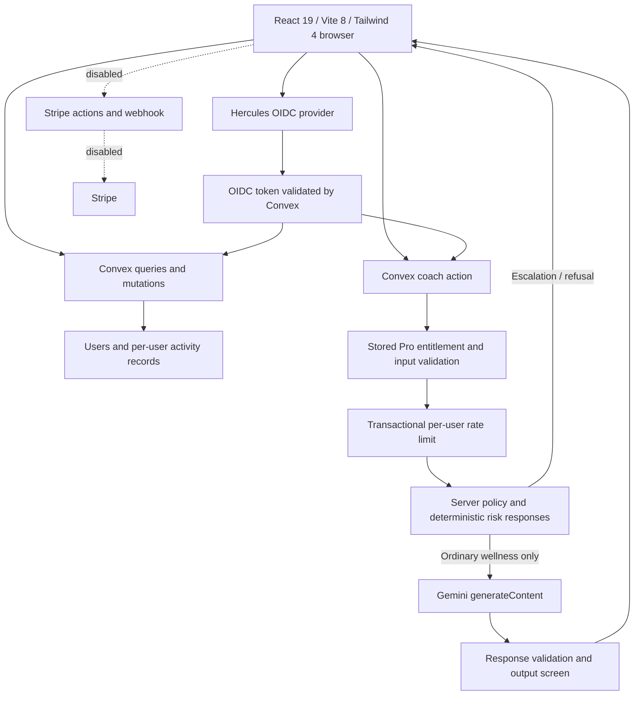

# Architecture

Public VITE_ configuration contains only the Convex URL and OIDC client information. GOOGLE_API_KEY is server-side only. No secrets are in the browser bundle by design. The shared challengeData module holds 81 restored activities and powers frontend metadata and backend task validation.

The existing Hercules auth callback waits for Convex authentication, synchronizes the user, then returns home. Authenticated / unauthenticated / loading gates wrap each page. ErrorBoundary provides a generic recovery screen. Missing public configuration shows a setup screen.

isPro is stored in Convex, never inferred from query strings or supplied by the browser. Existing Stripe code is retained behind hard disabled gates. Its entitlement lifecycle is not certified for activation.

Tests are separate from production entry points. convex-test executes real queries, mutations and actions against an in-memory backend. The browser fixture imports real pages with test-only aliases for Convex and OIDC. Neither a browser demo mode nor an authentication bypass is added to the production application. npm run build only builds index.html.
